# ChargeSource Architecture Diagrams (Mermaid Format)

## 1. System Architecture Overview

```mermaid
graph TB
    subgraph Client["🖥️ CLIENT (React 18 + TypeScript + Vite)"]
        Pages["📄 Pages<br/>Dashboard, Projects<br/>Quotes, Analytics"]
        Components["🧩 Components<br/>UI Library, Forms<br/>Project Wizard"]
        StateManagement["📊 State<br/>useAuth, useQuery<br/>React Context"]
        Services["⚙️ Services<br/>projectService<br/>quoteService"]
    end

    subgraph Server["🔌 SERVER (Express.js)"]
        AuthRoutes["🔐 Auth Routes<br/>/login, /register<br/>/callback"]
        APIRoutes["🛣️ API Routes<br/>/projects, /quotes<br/>/files"]
        Middleware["🔒 Middleware<br/>CORS, Auth Check<br/>Error Handling"]
        Serverless["⚡ Netlify Functions<br/>serverless-http<br/>Event Adapters"]
    end

    subgraph Backend["☁️ BACKEND (Supabase)"]
        PostgreSQL["🗄️ PostgreSQL<br/>users, projects<br/>quotes, file_assets"]
        Auth["🔐 Auth Service<br/>JWT, OAuth<br/>Session Mgmt"]
        Storage["💾 Storage<br/>S3 Buckets<br/>documents, files"]
        Functions["⚡ Edge Functions<br/>Deno Functions<br/>PDF Gen, File Ops"]
        Realtime["📡 Realtime<br/>WebSocket<br/>Subscriptions"]
    end

    subgraph External["🌐 EXTERNAL INTEGRATIONS"]
        Accounting["📊 Accounting<br/>Xero, MYOB<br/>QuickBooks"]
        CRM["👥 CRM<br/>HubSpot<br/>Pipedrive"]
        Email["📧 Email<br/>SendGrid<br/>AWS SES"]
        Payments["💳 Payments<br/>Stripe<br/>PayPal"]
        Maps["🗺️ Maps<br/>Google Maps<br/>Geocoding"]
    end

    Client -->|HTTP/REST| Server
    Server -->|Query/Mutation| Backend
    Backend -->|API Calls| External
    
    style Client fill:#f0f9ff,stroke:#0891b2,stroke-width:2px
    style Server fill:#fef3c7,stroke:#f59e0b,stroke-width:2px
    style Backend fill:#d1fae5,stroke:#10b981,stroke-width:2px
    style External fill:#fee2e2,stroke:#ef4444,stroke-width:2px
```



---

## 2. Data Flow: Quote Creation to Invoice


---

## 3. Authentication Flow

```mermaid
graph LR
    subgraph Auth["🔐 Authentication Flow"]
        A["User Login Page"]
        B["Email/Password<br/>or Google OAuth"]
        C["Supabase Auth"]
        D["JWT Token<br/>+ Refresh Token"]
        E["Session Storage<br/>localStorage"]
        F["useAuth Hook"]
        G["Protected Routes"]
    end

    A -->|Credentials| B
    B -->|signInWithEmail()<br/>or signInWithOAuth| C
    C -->|Valid| D
    D -->|Store| E
    E -->|useAuth checks| F
    F -->|Is authenticated?| G

    G -->|Yes| H["✅ Access Dashboard"]
    G -->|No| I["🔴 Redirect to Login"]

    style Auth fill:#f0f9ff,stroke:#0891b2,stroke-width:2px
    style H fill:#d1fae5
    style I fill:#fee2e2
```

---

## 4. Project Workflow State Machine

```mermaid
stateDiagram-v2
    [*] --> Planning
    
    Planning --> Quoting: Create Quote
    Planning --> Draft: Save as Draft
    
    Draft --> Planning: Edit Project
    Draft --> Quoting: Create Quote
    
    Quoting --> Planning: Return to Plan
    Quoting --> Quoted: Quote Ready
    
    Quoted --> InProgress: Client Accepts
    Quoted --> Planning: Modify & Requote
    
    InProgress --> Completed: Installation Done
    InProgress --> OnHold: Pause Project
    
    OnHold --> InProgress: Resume
    
    Completed --> [*]
    
    Planning -.->|Save to localStorage| Storage[(💾 Storage)]
    Quoting -.->|Save to localStorage| Storage
    InProgress -.->|Cloud sync| Cloud[(☁️ Supabase)]
    
    note right of Planning
        Site assessment,
        charger selection,
        compliance checks
    end note
    
    note right of Quoting
        Dynamic pricing,
        PDF generation,
        client review
    end note
    
    note right of InProgress
        Project tracking,
        document sharing,
        progress updates
    end note
```

---

## 5. Feature Implementation Status Matrix

```mermaid
xychart-beta
    title ChargeSource Feature Status
    x-axis [Q1 2024, Q2 2024, Q3 2024, Q4 2024, Q1 2025]
    y-axis "Implementation %" 0 --> 100
    
    line [30, 50, 70, 85, 95] name "Project Management"
    line [40, 65, 85, 92, 98] name "Smart Quoting"
    line [20, 35, 50, 65, 75] name "Document Management"
    line [10, 15, 25, 40, 50] name "Integrations"
    line [5, 10, 20, 35, 45] name "Analytics"
    line [0, 5, 10, 20, 35] name "Mobile App"
```

---

## 6. Integration Status Overview

```mermaid
graph LR
    subgraph Working["✅ WORKING"]
        W1["Project Management"]
        W2["Smart Quoting Engine"]
        W3["Authentication"]
        W4["Compliance Checklist"]
        W5["Analytics Dashboard"]
    end

    subgraph Partial["⚠️ PARTIAL"]
        P1["Document Storage"]
        P2["Client Portal"]
        P3["CRM Stubs"]
        P4["Google Maps"]
        P5["Payment UI"]
    end

    subgraph NonFunctional["❌ NON-FUNCTIONAL"]
        N1["Email Sending"]
        N2["Xero/MYOB/QB Sync"]
        N3["Geocoding"]
        N4["Project Cloud Deletion"]
        N5["Real-time Sync"]
    end

    subgraph Planned["🔄 PLANNED"]
        PL1["Mobile App"]
        PL2["Advanced Reports"]
        PL3["White-label Portal"]
        PL4["Multi-tenancy"]
        PL5["AI Recommendations"]
    end

    Working -.->|Next: Stabilize| Partial
    Partial -.->|Next: Complete| NonFunctional
    NonFunctional -.->|Q2 2025| Planned

    style Working fill:#d1fae5,stroke:#10b981,stroke-width:2px
    style Partial fill:#fef3c7,stroke:#f59e0b,stroke-width:2px
    style NonFunctional fill:#fee2e2,stroke:#ef4444,stroke-width:2px
    style Planned fill:#dbeafe,stroke:#3b82f6,stroke-width:2px
```



---

## 7. Deployment Architecture


---

## 8. Australian Compliance Architecture

```mermaid
graph LR
    subgraph Compliance["🇦🇺 Australian Compliance"]
        AS3000["AS/NZS 3000<br/>Electrical Standards"]
        GST["GST Compliance<br/>10% Australian"]
        Licensing["State Licensing<br/>Requirements"]
        Privacy["Privacy Act 1988<br/>Australian APPs"]
        WorkHealth["Work Health &<br/>Safety Act"]
    end

    subgraph Implementation["ChargeSource Features"]
        Checklist["✅ Compliance Checklist"]
        GSTCalc["✅ GST Auto-Calc"]
        LicenseTrack["⚠️ License Tracking"]
        AuditLog["⚠️ Audit Logs"]
        SafetyChecks["⚠️ Safety Checklists"]
    end

    AS3000 --> Checklist
    GST --> GSTCalc
    Licensing --> LicenseTrack
    Privacy --> AuditLog
    WorkHealth --> SafetyChecks

    style Compliance fill:#f0f9ff,stroke:#0891b2,stroke-width:2px
    style Implementation fill:#fef3c7,stroke:#f59e0b,stroke-width:2px
```



---

## 9. Database Schema Relationships


---

## 10. Feature Implementation Timeline


---

## Key Insights from Diagrams

### 🟢 Strengths
- Robust React + Express + Supabase architecture
- Good separation of concerns (Client → Server → Backend)
- PostgreSQL provides strong data consistency
- Edge functions support serverless scaling

### 🟡 Areas for Attention
- Multiple integration stubs (Email, CRM, Accounting)
- Cloud persistence not fully wired in ProjectWizard
- Geocoding/Address mapping incomplete
- Supabase functions not deployed

### 🔴 Critical Blockers
- Email sending stubbed (demo-only)
- CRM lead submission simulated
- Storage buckets require manual setup
- Project cloud deletion not implemented

### ✅ Ready for Production Use
- Project management workflows
- Quote generation & PDFs
- Authentication & authorization
- Compliance checklist (AS/NZS 3000)
- Analytics dashboards

---

## Recommended Implementation Order

1. **Phase 1 (Week 1-2):** Verify Supabase, deploy edge functions, configure email
2. **Phase 2 (Week 3-4):** Wire ProjectWizard cloud save, implement geocoding
3. **Phase 3 (Week 5-8):** Complete integrations (Xero, HubSpot), real payment processing
4. **Phase 4 (Week 9+):** Advanced features (mobile app, real-time sync, white-label)

