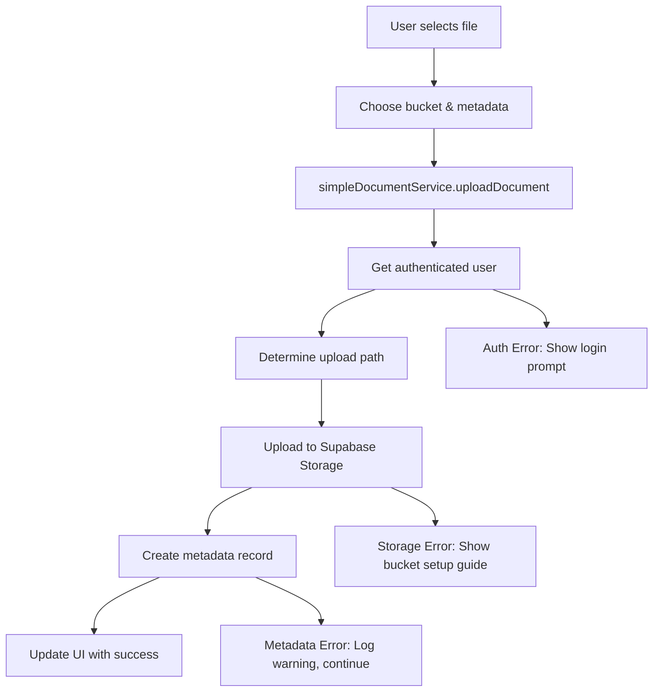

# ChargeSource Storage Document Process - Comprehensive Review

## 🔍 Current Status Overview

### ✅ **What's Working:**

- ✅ Storage bucket configuration (3 buckets defined)
- ✅ Simple document upload service with direct Supabase client
- ✅ File path structure: `${user.id}/${filename}` or `${organizationId}/${filename}`
- ✅ React components for testing and management
- ✅ Database table schemas defined
- ✅ Row Level Security policies configured

### ❌ **Critical Issues Found:**

1. **UUID Format Mismatch** - Mock auth generates `user-${timestamp}` but DB expects UUID format
2. **Missing Database Tables** - Tables may not exist in Supabase yet
3. **Storage Buckets Not Created** - Physical buckets missing in Supabase Storage

## 📋 Storage Bucket Configuration

### **charge-source-user-files**

- **Purpose**: Personal files and general documents
- **Max File Size**: 50MB per file
- **Max Total Storage**: 5GB per bucket
- **Allowed File Types**:
  - Documents: PDF, DOC, DOCX, XLS, XLSX, TXT, CSV
  - Images: JPEG, PNG, WebP
- **Security**: User-only access (user.id folder structure)

### **charge-source-documents**

- **Purpose**: Official documents, manuals, reports, specifications
- **Max File Size**: 100MB per file
- **Max Total Storage**: 10GB per bucket
- **Allowed File Types**:
  - Documents: PDF, DOC, DOCX, XLS, XLSX, TXT, CSV
  - Archives: ZIP, compressed files
- **Security**: User or organization access

### **charge-source-videos**

- **Purpose**: Training videos and media content
- **Max File Size**: 500MB per file
- **Max Total Storage**: 50GB per bucket
- **Allowed File Types**:
  - Videos: MP4, MPEG, QuickTime, AVI, WebM
- **Security**: User or organization access

## 🔧 File Upload Process Flow



## 🗃️ Database Schema

### **document_metadata** table

```sql
CREATE TABLE document_metadata (
  id UUID DEFAULT gen_random_uuid() PRIMARY KEY,
  user_id UUID REFERENCES auth.users(id),     -- ❌ ISSUE: Mock auth uses strings, not UUIDs
  organization_id UUID DEFAULT NULL,
  bucket_name TEXT NOT NULL,
  file_path TEXT NOT NULL,
  original_filename TEXT NOT NULL,
  file_size BIGINT NOT NULL,
  mime_type TEXT NOT NULL,
  category TEXT DEFAULT 'uncategorized',
  tags TEXT[] DEFAULT '{}',
  description TEXT,
  status TEXT DEFAULT 'draft',
  version INTEGER DEFAULT 1,
  metadata JSONB DEFAULT '{}',
  created_at TIMESTAMP WITH TIME ZONE DEFAULT NOW(),
  updated_at TIMESTAMP WITH TIME ZONE DEFAULT NOW(),
  approved_by UUID REFERENCES auth.users(id),
  approved_at TIMESTAMP WITH TIME ZONE,
  UNIQUE(bucket_name, file_path)
);
```

### **document_versions** table

```sql
CREATE TABLE document_versions (
  id UUID DEFAULT gen_random_uuid() PRIMARY KEY,
  document_id UUID REFERENCES document_metadata(id),
  version_number INTEGER NOT NULL,
  file_path TEXT NOT NULL,
  file_size BIGINT NOT NULL,
  created_by UUID REFERENCES auth.users(id),   -- ❌ ISSUE: Same UUID format issue
  created_at TIMESTAMP WITH TIME ZONE DEFAULT NOW(),
  change_notes TEXT,
  UNIQUE(document_id, version_number)
);
```

## 🔐 Security Model

### **Row Level Security (RLS) Policies**

```sql
-- Users can only access their own documents
CREATE POLICY "Users can view their own documents" ON document_metadata
  FOR SELECT USING (auth.uid() = user_id);

-- Users can only access files in their folders
CREATE POLICY "Users can view their own documents storage" ON storage.objects
  FOR SELECT USING (
    bucket_id = 'charge-source-documents' AND
    auth.uid()::text = (storage.foldername(name))[1]
  );
```

### **Access Control Matrix**

| Resource        | User Files     | Documents      | Videos         | Metadata       |
| --------------- | -------------- | -------------- | -------------- | -------------- |
| **Own Files**   | ✅ Full Access | ✅ Full Access | ✅ Full Access | ✅ Full Access |
| **Org Files**   | ❌ No Access   | ✅ Read/Write  | ✅ Read/Write  | ✅ Read/Write  |
| **Other Users** | ❌ No Access   | ❌ No Access   | ❌ No Access   | ❌ No Access   |

## 🚨 Issues & Solutions

### **Issue 1: UUID Format Mismatch**

```typescript
// ❌ Current: Mock auth generates
id: `user-${Date.now()}`; // "user-1754807921952"

// ✅ Required: Valid UUID format
id: "550e8400-e29b-41d4-a716-446655440000";
```

**Solution**: Update mock auth to generate proper UUIDs

### **Issue 2: Missing Storage Buckets**

**Error**: `Storage bucket 'charge-source-documents' not found`

**Solution**: Run SQL script to create buckets:

```sql
INSERT INTO storage.buckets (id, name, public) VALUES
  ('charge-source-user-files', 'charge-source-user-files', false),
  ('charge-source-documents', 'charge-source-documents', false),
  ('charge-source-videos', 'charge-source-videos', false)
ON CONFLICT (id) DO NOTHING;
```

### **Issue 3: Missing Database Tables**

**Error**: `Could not find the table 'public.document_metadata'`

**Solution**: Run complete database setup SQL script

## 🧪 Testing Process

### **Current Test Flow**

1. Visit `/DocumentTest` or `/document-test`
2. Login with any email (mock auth)
3. Select file and bucket
4. Add metadata (category, description, organization)
5. Upload and verify in file list

### **Test Cases to Verify**

| Test Case             | User Files     | Documents      | Videos         | Expected Result |
| --------------------- | -------------- | -------------- | -------------- | --------------- |
| **Small PDF**         | ✅ Should work | ✅ Should work | ❌ Wrong type  | Success/Error   |
| **Large Video**       | ❌ Size limit  | ❌ Size limit  | ✅ Should work | Success/Error   |
| **Organization File** | N/A            | ✅ Should work | ✅ Should work | Correct path    |
| **Metadata Creation** | ✅ Optional    | ✅ Required    | ✅ Optional    | DB record       |

## 🔄 Complete Integration Steps

### **Phase 1: Fix Core Issues**

1. ✅ Fix UUID generation in mock auth
2. ✅ Create storage buckets in Supabase
3. ✅ Create database tables and policies
4. ✅ Test basic upload/list functionality

### **Phase 2: Enhanced Features**

1. File version management
2. Approval workflows
3. Advanced search and filtering
4. Bulk operations
5. File preview capabilities

### **Phase 3: ChargeSource Integration**

1. Connect to project management
2. Quote attachment system
3. Customer portal access
4. Compliance document tracking

## 📊 Usage Recommendations

### **charge-source-user-files**

- Personal contractor certificates
- Individual project photos
- Personal documentation
- Training completion certificates

### **charge-source-documents**

- Project specifications
- Installation manuals
- Compliance certificates
- Contract documents
- Technical drawings
- Inspection reports

### **charge-source-videos**

- Installation training videos
- Safety procedure videos
- Equipment demonstration videos
- Customer testimonials

## 🔍 Monitoring & Analytics

### **Key Metrics to Track**

- Upload success/failure rates by bucket
- Storage usage per bucket
- Most uploaded file types
- User adoption by role
- Document approval turnaround times

### **Error Monitoring**

- Authentication failures
- Storage quota exceeded
- Invalid file type uploads
- Database constraint violations
- RLS policy denials

## 🚀 Next Steps

1. **Immediate**: Fix UUID format issue
2. **Short-term**: Complete database setup
3. **Medium-term**: Enhance testing interface
4. **Long-term**: Full ChargeSource integration

---

**Status**: 🔧 Setup Required - Critical issues need fixing before production use
**Priority**: 🔥 High - Core functionality currently blocked
**Timeline**: 📅 1-2 hours to resolve critical issues
